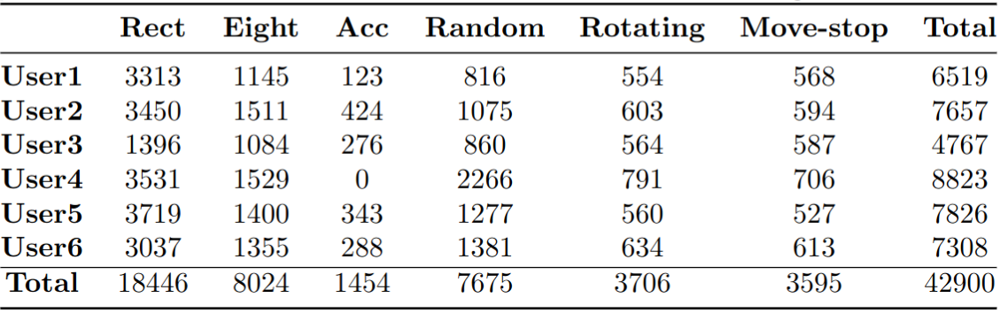
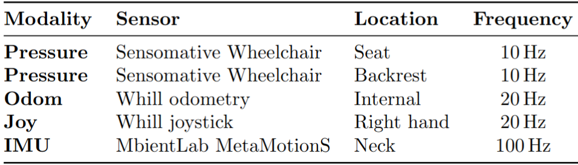
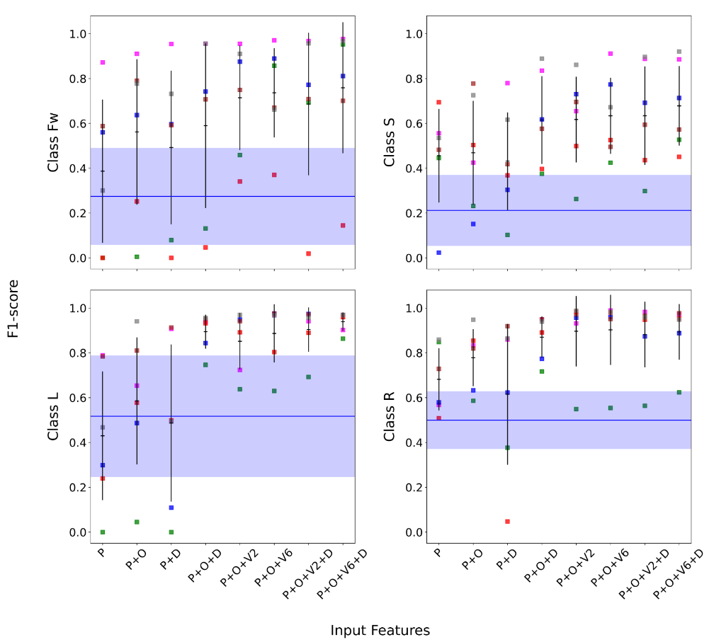
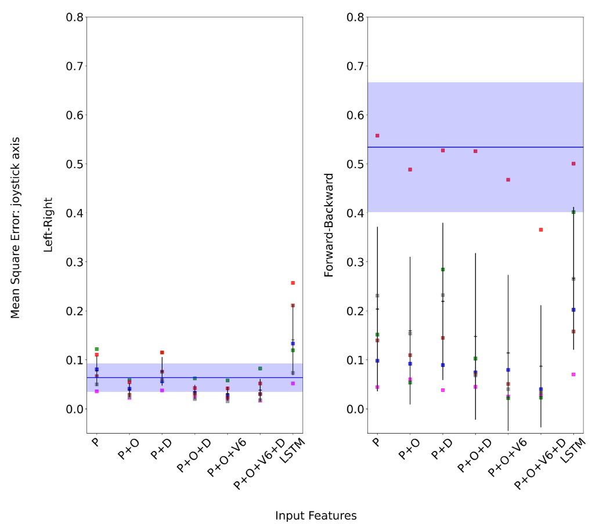

<div align="center">
    <h1>End-to-End Posture Control with Pressure Mats</h1>
    <br />
    <br />
    
Data Collection |  Artificial Neural Network |  Center of Pressure
:-------------------------:|:-------------------------:|:-------------------------:
  |   |  
Protocol used for the collection of data: each participant is asked to move along well defined circuit shapes using the wheelchair joystick (the joystick is on the right of the wheelchair) and to mimic the posture changes that would be needed for a posture control. In this exemple, the participant performs the "move forward and brake" circuit shape |  Results of the artificial neural network for a time delay of 0.3second (ANN-D3). The input features used to train this model are: pressure, differential pressure (with a time delay of 0.3second) and odometry. The joystick values are used as ground truth. No calibration needed: the driver seats on the wheelchair and can start navigate.  |  Result of the center of pressure algorithm (COP). This control algorithm requires a calibration step. We can notice that the reaction time to posture changes is faster than for the ANN-D3 and that depending on the sitting position, the forward motion is very impacted by the inverted pendulum effect. 


</div>

## ABSTRACT:

We provide a new dataset for an end-to-end posture control and intention recognition. We present a comprehensive comparison of different posture control algorithms based on this dataset. 

Keywords: Pressure sensors, Dataset, Multi-modal, End-to-end posture control, Intention recognition.

## MAIN CONTRIBUTIONS: 

   * A dataset: two dynamical settings, four control variations: moving forward, turn left/right and brake.
     
   * Ground truth with labeled data for a set of six participants with broad range of body dimensions.
   * Use the collected data to train the ANN to control the wheelchair using only the pressure sensors (and the integrated odometry). No wearable sensor is required. This should allow 

   * Baseline comparison of the state-of-the-art center of pressure algorithm, test of the dynamical effects due to the inverted pendulum effects on the trained ANN models.

## Updates 

2024.05.10  Initial dataset upload
 

## 1. LICENSE

GPL-3.0 License

 
## 2. SENSOR SETUP

### 2.1 Data acquisition platform


<div align=center>

</div>
<p align="center"> Collected data for each circuit shape variations and for the two dynamical settings (speed level 1 and 3). </p>


### 2.2 Sensor parameters

Sensor specification for the presented dataset. 
<div align=center>

</div>
 

### 2.3 ROS topics

The rostopics of our rosbag sequences are listed as follows:

* Seat Pressure mat : \
`/pressuremat_array :   std_msgs/Int64MultiArray`

* Back Pressure mat : \
`/backpressuremat_array :  std_msgs/Int64MultiArray`

* IMU : \
` /imu       : sensor_msgs/Imu `       
 
* Odometry : \
`/whill/odom : nav_msgs/Odometry `         

 * Others :\
             `/rosout                       : rosgraph_msgs/Log      ` 
             `/tf                           : tf2_msgs/TFMessage     `    
             `/whill/states/batteryState    : sensor_msgs/BatteryState ` 
             `/whill/states/jointState      : sensor_msgs/JointState   ` 
 
 

## 3. DATASET SEQUENCES

Sequence Name|Circuit Shapes|Recordings
--|:--|:--:|
user1, s1|rectangle, rotation in place, forward with braking, eight-figure, random motion|[Rosbag_link](./data/speed_level1/user1/) [csv_link](./data/csv_files/)
user1, s3|rectangle, rotation in place, forward with braking, eight-figure, random motion, acceleration|[Rosbag_link](./data/speed_level3/user1/) [csv_link](./data/csv_files/)
user2, s1|rectangle, rotation in place, forward with braking, eight-figure, random motion|[Rosbag_link](./data/speed_level1/user2/) [csv_link](./data/csv_files/)
user2, s3|rectangle, rotation in place, forward with braking, eight-figure, random motion, acceleration|[Rosbag_link](./data/speed_level3/user2/) [csv_link](./data/csv_files/)
user3, s1|rectangle, rotation in place, forward with braking, eight-figure, random motion|[Rosbag_link](./data/speed_level1/user3/) [csv_link](./data/csv_files/)
user3, s3|rectangle, rotation in place, forward with braking, eight-figure, random motion, acceleration|[Rosbag_link](./data/speed_level3/user3/) [csv_link](./data/csv_files/)
user4, s1|rectangle, rotation in place, forward with braking, eight-figure, random motion|[Rosbag_link](./data/speed_level1/user4/) [csv_link](./data/csv_files/)
user4, s3|rectangle, rotation in place, forward with braking, eight-figure, random motion, acceleration|[Rosbag_link](./data/speed_level3/user4/) [csv_link](./data/csv_files/)
user5, s1|rectangle, rotation in place, forward with braking, eight-figure, random motion|[Rosbag_link](./data/speed_level1/user5/) [csv_link](./data/csv_files/)
user5, s3|rectangle, rotation in place, forward with braking, eight-figure, random motion, acceleration|[Rosbag_link](./data/speed_level3/user5/) [csv_link](./data/csv_files/)
user6, s1|rectangle, rotation in place, forward with braking, eight-figure, random motion|[Rosbag_link](./data/speed_level1/user6/) [csv_link](./data/csv_files/)
user6, s3|rectangle, rotation in place, forward with braking, eight-figure, random motion, acceleration|[Rosbag_link](./data/speed_level3/user6/) [csv_link](./data/csv_files/)

  

* Note: For some users, the IMU was sometimes disconnected.
* Note: the code used to record the data can be found in the folder scripts/ under the name: record_rosbag.sh (?? is this fine to publish it with the config file?)

### 3.1 Ground Truth:
The meaning of each column in ground truth files is as follows:  
~~~
timestamp, /whill/states/joy axis 1 and axis 2
~~~


## 4. RESULTS 
We compared our results for the ANN to the state-of-the art COP algorithm. The computation of COP we use here is adapted from the paper from Yang Chen et al 2020  (https://arxiv.org/abs/2008.01181).

### 4.1 Intention recognition
Classification, F1-score performance per user and input data.
Only the following shapes have been used to train the model: rectangle, move forward and brake, and rotation in place.
<div align=center>

<p align="center">Comparison of the F1-score performance per user and class, for each
of the tested input features. Each color corresponds to one user. The input features are: ”P”, seat pressure; ”D”,
differential pressure with a step of 0.3 second in the past; ”O”, odometry; ”V2/V6”,
odometry delayed by up to 0.2/0.6 second.
In blue we show the corresponding F1-score obtained with the COP method:
mean(solid line) and standard deviation(shaded area) of the distribution of performances of the six users. For the four classes, from top to
bottom, left to right: moving forward, turning left, stopping and turning right.
We note that the data has undergone initial cleaning to prevent multiclass labeling (more details can be found in the thesis report).</p>
</div>

### 4.22 End to end posture control
End-to-end posture control, Mean-Square-Error performance per user and input data.
Only the following circuit shapes have been used to train the model: rectangle, move forward and brake, rotation in place, and figure-eight.
<div align=center>

<p align="center">Comparison of the Mean Square Error (MSE) loss per user and joystick
axis, for each of the tested input features. The input features are: ”P”, seat+back
pressure; ”D”, differential pressure with a step of 0.3 second in the past; ”O”,
odometry; ”V6”, odometry delayed by up to 0.6 second. We also compare to these
results the outcomes obtained by adding a single LSTM layer to the architecture, with only the
pressure and the odometry as input data. The look-back parameter has been set to
10. In blue we show the corresponding MSE loss obtained with the COP method: mean(solid line) and standard deviation(shaded area) of the distribution of performances of the six users.
Left: joystick axis to control the Left/Right motion; right, the forward/backward
motion. We note that raw data is utilized without requiring preprocessing.</p>
</div>

Joystick values: ground truth versus predictions
:-------------------------:
  
Illustration of the end-to-end control algorithm in real-time and on unseen data (here the random motion at speed level 3). Top panel: control command for turning left/right: ground truth in green, predictions in blue; Bottom panel: control command for moving forward and braking: ground truth in orange, predictions in red. The x-axis represents the number of frames (at 10 Hz). Produced using the software plotjuggler (https://plotjuggler.io/).

  
## 5. DEVELOPMENT TOOLKITS 

### 5.1 Software versions requirements:
- numpy: '1.24.3'
- keras (tensorflow): '2.13.1'
- sklearn: '1.4.1.post1'
- scikeras: '0.12.0'
- pandas: '2.2.1'
- matplotlib: '3.6.0'
- seaborn: '0.11.0'

The codes used to train and load the models can be found in the folder scripts/.

### 5.2 Connect to the hardware:
We assume here that the ROS topics from the pressure mat are published and that the user knows how to control the whill wheelchair.

- #### train the machine learning model
~~~
python3 train_MLmodel.py
~~~
It will produce a .keras trained neural network that can be then loaded and tested on the wheelchair.
In the current version, we use a fully connected architecture. Note that the set of input features and the time step (delta) for the computation of the differential pressure are free parameters of the trained model.
As an example, the folder /trained_models contain the models that have been used in the qualitative assessment experiment.
- #### load the trained machine learning model or run the COP algorithm
The trained machine learning algorithm runs on ROS1. 
Before running the following command, both the number of input features and the value of the parameter delta need to be updated.
~~~
source ROS1 environment
python3 run_trained_MLmodel.py
~~~

Alternatively, the COP algorithm can be used to control the wheelchair. This relies on the pressure mats sensors values which run on ROS2.
~~~
source ROS2 environment
source ros_healthcare ws
python3 cop.py 
~~~
This requires a calibration step.
The calibration step lasts 10 seconds, where the driver is being asked to:
- move in all directions (e.g., draw a circle with the upper-body): this will determine the posture changes needed to control the wheelchair and should not be too exagerated.
- lean on the back: this corresponds to the "resting position".
It is very important that the driver does not move from the resting position during the last two seconds of the calibration.
If he/she moves, the whole calibration procedure need to be repeated. In this case, just rerun the python code.

Note that the published topic has the name: rostopic echo /pressuremat_cmd_vel_acc
## 6. ACKNOWLEGEMENT
We would like to thank all the people at ETHZ that have supported this study, took part in the collection of data and in the qualitative assessment experiments.
```
add here a link to the thesis
```
 
